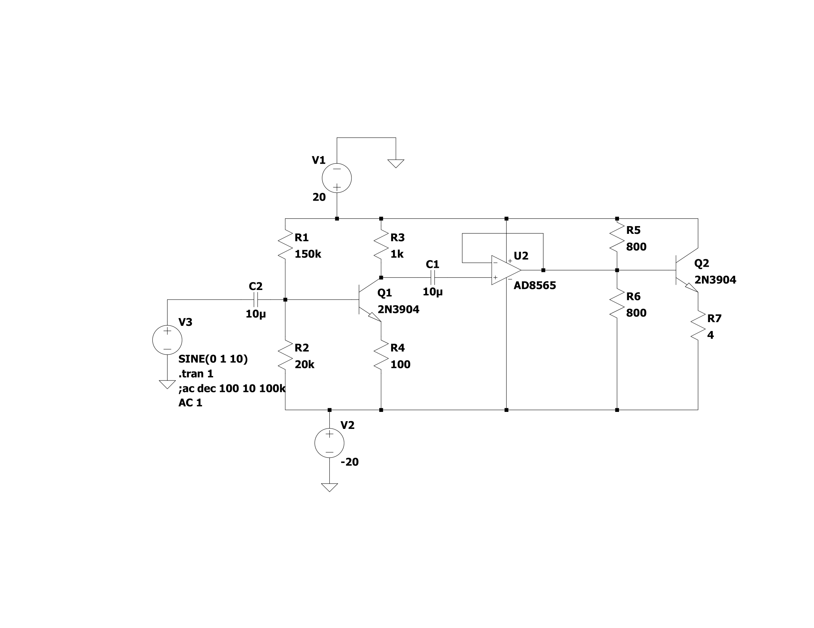

# Audio_Amplifier 🔊
Designing a push–pull audio amplifier for a car speaker

## Goal 🎯
The goal of this project was to design a simple audio amplifier to drive a 4-ohm, 30-watt RMS (42 Watt peak) speaker extracted from a car door. The objective was not to create the most efficient design, but rather to explore various design approaches.

  

## To-do List 📃
- [x] Pick amplifier class
- [x] Pick power stage amplifier
- [x] Design and simulate in LTSPICE
- [ ] Pick components with appropriate ratings
- [ ] Determine thermal output of transistors
- [ ] PCB design
- [ ] Testing

## History 📃
Initially, I began by driving the speaker with my USB oscilloscope/waveform generator (Analog Discovery 2). The USB waveform generator has the ability to take an MP3 file as an input and output the corresponding waveform. It also has the ability to amplify the signal up to a peak voltage of 5V. However, there were a few problems with this:
1. According to the datasheet, this waveform generator has the ability to output a maximum current of 750mA. At a peak voltage of 5V, the power output would only be (0.75A x 5V = 3.75W peak * 0.707 = 2.65W RMS) 2.65 watts RMS, which is only about 9% of the speaker's power output capabilities
2. When set to 5V peak output, the waveform generator only seemed to be able to push out 250mA. This means we were only achieving a power output of (0.25A * 5V = 1.25W peak * 0.707 = 0.883W RMS) 0.883 watts RMS.
3. Lastly, when set to 5V, the speaker seemed to suffer from a lot of distortion and resulted in very muddy tones
4. The final motivation was to see if I could drive the speaker significantly louder. With a 1V waveform signal the loudest sound seemed to be around *INSERT DB MEASUREMENT*

## Constraints ⚠️
While devising the design for this project, I established a few constraints to prevent overcomplication. The constraints/rules I settled on were as follows:
* The input/audio signal would be anywhere from 100mV to 1V
* I didn't have to make use of the full 30 watt power capabilities of the speaker

# Audio Amplifier Background
To drive a speaker louder (higher output power) there are two things to keep in mind. These elements are evident in the power equation $P = V × I$. To acheive a higher output power we must amplify both voltage and current. Achieving greater output power necessitates amplifying both voltage and current. Therefore, we divide our amplifier design into two stages: the voltage/signal amplifier stage and the current/power amplifier stage. This practice is widely employed in all types of audio amplifiers.

The subsequent step in the process involved determining the preferred classification of audio amplifiers for this design. There are four main classes: A, B, AB, and Class D. Further information about these classifications can be found in the links provided below.

  

I ended up settling on the class AB design for the following reasons:
* The class AB design is more efficient than the class A design (50 - 70% efficiency)
* The Class AB design does not suffer from the same clipping distortion as the Class B design. It benefits from biasing the transistors in a manner that ensures their conduction throughout all cycles of the input waveform
* It is less complex than a class D design
* The only drawback is that when there is no input signal, the transistors continue to conduct current, resulting in wasted power

The second decision was whether to use MOSFETs or BJTs for the power stage amplifier. I ultimately chose MOSFETs for the following reasons:
* They generally have high input impedance, which reduces the loading effect on the preceding stages
* They require no current to drive the gate pin
* They can switch faster than BJTs, which can be beneficial in certain applications
* Reduced distortion compared to some BJT designs
* The only drawback is they tend to be more expensive than BJT's

### Initial Design
My initial design was based on the class A amplifier design, which can be seen in the image below. However, the problem was that it drew too much current from the op-amp, and when no signal was fed, the amplifier continued to conduct large amounts of current.

  
  
<small><i>Class A Amplifier Design in LTSPICE</i></small

# Design
## Schematic

  
  
<small><i>LTSPICE Schematic Capture</i></small>

* For this design, I ended up choosing the LT1124 op-amp for the signal amplifying stage. There were a couple of reasons behind this decision. Initially, I had planned for that stage to use a common emitter amplifier. However, the issue was that it required fine-tuning to determine the bias voltages. Additionally, by using the LT1124 op-amp, I could incorporate a potentiometer for variable gain ranging from 0 to 10dB.
* For the power stage of this amplifier, I ended up utilizing the op-amp's inverting terminal as a negative feedback loop for the push-pull configuration. This allowed me to avoid fine-tuning the bias voltages with resistors and diodes.

## Simulation

  
  
<small><i>[1]Input Voltage [2]Output Current [3]Output Voltage</i></small

  
  
<small><i>Circuit Frequency Response 20Hz - 48kHz</i></small

  
# Parts
## OP-AMP
I ended up settling on the [LT1124](https://www.analog.com/en/products/lt1124.html)
* Power supply range: ±22V (Dual rail supplies)
* Slew rate: 3.9 - 4.5 V/us
  * To maintain high fidelity audio it is recommended to have a slew rate of +5V/us.
  * We can determine the minimum slew rate given the expected output voltage and frequency. Our maximum output voltage should be 10V and our maximum frequency should be around 20kHz (The upper limit of human hearing). Using the slew rate formula ($Slew Rate = 2πfv$)
  * $Minimum Slew Rate = 2 * π * 20000 * 10 = 1.256V/μS$ 
* Gain-Bandwidth product: 12.5MHz
* Low voltage noise: 2.7nV/√Hz Typ

## N-MOSFET
I ended up settling on the [IRFZ34NPBF](https://www.digikey.ca/en/products/detail/infineon-technologies/IRFZ34NPBF/811724)
* Maximum VDS: 55V
* Continuous drain current: 29A
* Maximum power dissipation: 68W
  * No additional cooling is required since we will not exceed this power rating
* Gate to source voltage: ±20V
* Gate threshold voltage: 2-4V
* RDS(ON): 0.04 ohms
* Turn-on delay time: 7ns
* Rise time: 49ns
* Turn-off delay time: 31ns
* Fall time: 40ns
* Input capacitanceL 700pF

## P-MOSFET
I ended up settling on the [IRF9Z24NPBF](https://www.digikey.ca/en/products/detail/infineon-technologies/IRF9Z24NPBF/811747)
* Maximum VDS: -55V
* Continuous drain current: -12A
* Maximum power dissipation: 45W
  * No additional cooling is required since we will not exceed this power rating
* Gate to source voltage: ±20V
* Gate threshold voltage: (-2V)-(-4V)
* RDS(ON): 0.175 ohms
* Turn-on delay time: 13ns
* Rise time: 55ns
* Turn-off delay time: 23ns
* Fall time: 37ns
* Input capacitanceL 350pF

*Both MOSFET's chosen are overkill for our purposes but provide sufficient headroom for error and/or future upgrades*

## N-MOSFET Junction Temperature Calculation
$Pavg = (Irms^2 * Rds(on))/2$
 * $Irms = Ipeak/√2 = 3A / √2 = 2.12A$
 * Rds(on) = 0.040 ohms
 * $Pavg = (2.12A * 0.04ohms)/2 = 0.0424 W$
$Tj = Pavg * RthJA + TA$
 * $Pavg = 0.0424W$
 * $RthJA = 62W/C$
 * $TA = 25C$
 * $Tj = 0.0424W * 62W/C + 25C = 27.62C$

## P-MOSFET Junction Temperature Calculation
$Pavg = (Irms^2 * Rds(on))/2$
 * $Irms = Ipeak/√2 = 3A / √2 = 2.12A$
 * Rds(on) = 0.175 ohms
 * $Pavg = (2.12A * 0.175ohms)/2 = 0.1855 W$
$Tj = Pavg * RthJA + TA$
 * $Pavg = 0.1855W$
 * $RthJA = 62W/C$
 * $TA = 25C$
 * $Tj = 0.371W * 62W/C + 25C = 36.501C$

# Resources
* LTSPICE
* [Amplifier Series](https://www.youtube.com/watch?v=Yv75o45Zrak&list=PL1GmhyN81MlmMcJZy58bTeupRl7zOO8Sk&index=2&ab_channel=EEforEveryone)
* [Online Circuit Simulator](https://www.falstad.com/circuit/)
* [Introduction to the Amplifier](https://www.electronics-tutorials.ws/amplifier/amp_1.html)
* [Audio Amplifier Basics](https://www.youtube.com/watch?v=U0FIG2J6Zls&ab_channel=TexasInstruments)
* [Power Amplifiers](https://en.wikipedia.org/wiki/Power_amplifier_classes#Class_C)
