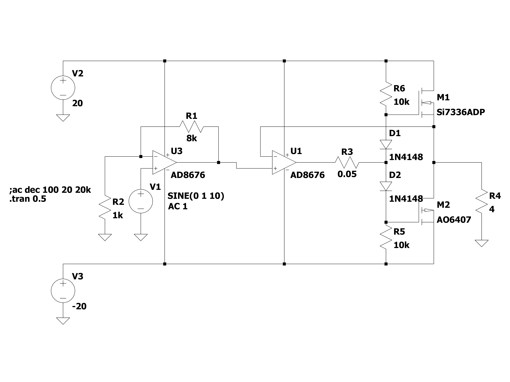
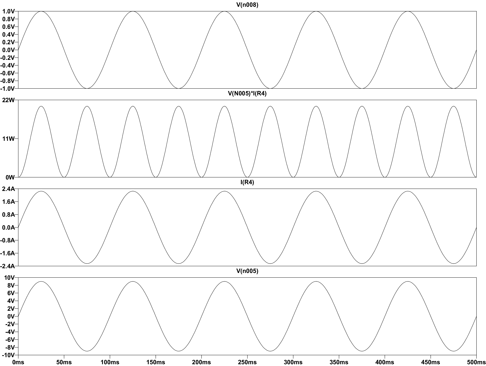
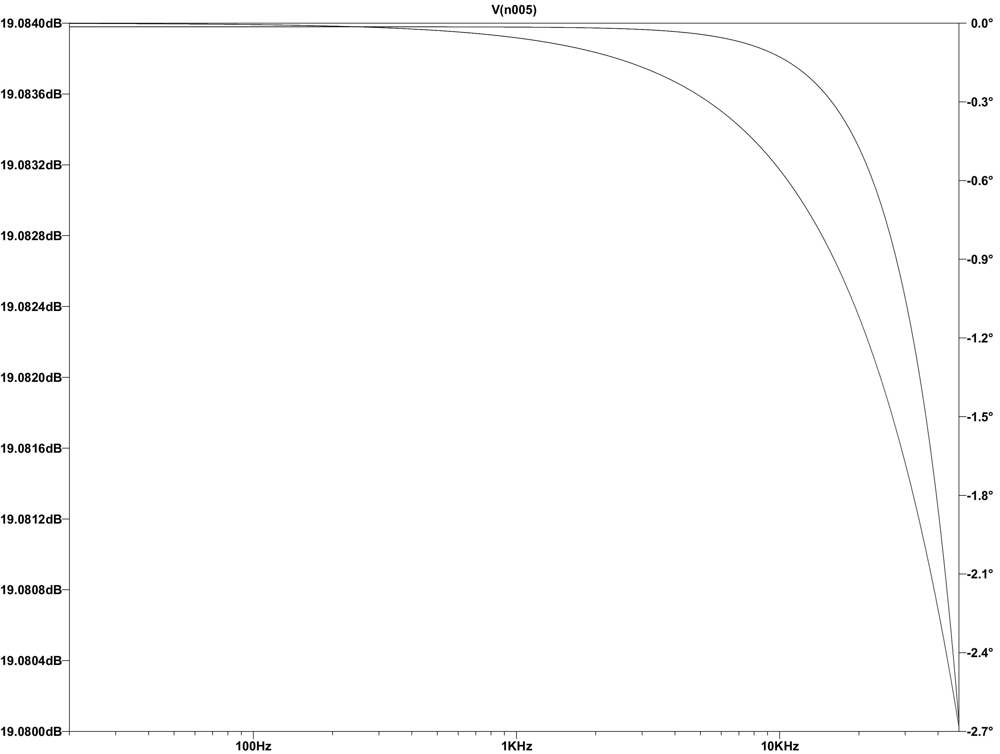

# Audio_Amplifier 🔊
Designing a push–pull audio amplifier for a car speaker

*DISCLAIMER - I want to preface by acknowledging that I'm not an expert in the realm of audio amplification. This field is incredibly vast and intricate. The project served as a valuable opportunity for me to delve deeper into this domain, but it's important to note that I might have made errors or made poor design choices in the process of learning* 

## Goal 🎯
The goal of this project was to design a simple audio amplifier to drive a 4-ohm, 30-watt RMS (42 Watt peak) speaker extracted from a car door. The objective was not to create the most efficient design, but rather to explore various design approaches.

  

## To-do List 📃
- [x] Pick amplifier class
- [x] Pick power stage amplifier
- [x] Design and simulate in LTSPICE
- [ ] Pick components with appropriate ratings
- [ ] Determine thermal output of transistors
- [ ] PCB design
- [ ] Testing

## History
Initially, I began by driving the speaker with my USB oscilloscope/waveform generator (Analog Discovery 2). The USB waveform generator has the ability to take an MP3 file as an input and output the corresponding waveform. It also has the ability to amplify the signal up to a peak voltage of 5V. However, there were a few problems with this:
1. According to the datasheet, this waveform generator has the ability to output a maximum of 750mA. At a peak voltage of 5V, the power output would only be (0.75A x 5V = 3.75W peak * 0.707 = 2.65W RMS) 2.65 watts RMS, which is only about 9% of its power output capabilities
2. When set to 5V peak output, the waveform generator only seemed to be able to push out 250mA. This means we were only achieving a power output of (0.25A * 5V = 1.25W) 1.25 watts
3. Lastly, when set to 5V, the speaker seemed to suffer from a lot of distortion and resulted in very muddy tones
4. The final motivation was to see if I could drive the speaker significantly louder. With a 1V waveform signal the loudest sound seemed to be around *INSERT DB MEASUREMENT*

## Constraints
While devising the design for this project, I established a few constraints to prevent overcomplication. The constraints/rules I settled on were as follows:
* The input/audio signal would be anywhere from 100mV to 1V
* I didn't have to make use of the full 30 watt power capabilities of the speaker

# Audio Amplifier Background
To drive a speaker louder (higher output power) there are two things to keep in mind. These elements are evident in the power equation $P = V × I$. To acheive a higher output power we must amplify both voltage and current. Achieving greater output power necessitates amplifying both voltage and current. Therefore, we divide our amplifier design into two stages: the voltage/signal amplifier stage and the current/power amplifier stage. This practice is widely employed in all types of audio amplifiers.

The subsequent step in the process involved determining the preferred classification of audio amplifiers for this design. There are four main classes: A, B, AB, and Class D. Further information about these classifications can be found in the links provided below.

  

I ended up settling on the class AB design for the following reasons:
* The class AB design is more efficient than the class A design (50 - 70% efficiency)
* The Class AB design does not suffer from the same clipping distortion as the Class B design. It benefits from biasing the transistors in a manner that ensures their conduction throughout all cycles of the input waveform
* It is less complex than a class D design
* The only drawback is that when there is no input signal, the transistors continue to conduct current, resulting in wasted power

The second decision was whether to use MOSFETs or BJTs for the power stage amplifier. I ultimately chose MOSFETs for the following reasons:
* They generally have high input impedance, which reduces the loading effect on the preceding stages
* The require no current to drive the gate pin
* They can switch faster than BJTs, which can be beneficial in certain applications
* Reduced distortion compared to some BJT designs
* The only drawback is they tend to be more expensive than BJT's

# Design
## Schematic

  
  
<small><i>LTSPICE Schematic Capture</i></small>

## Simulation

  
  
<small><i>[1]Input Voltage [2]Speaker Power Consumption [3]Output Current [4]Output Voltage</i></small

  
  
<small><i>Circuit Frequency Response 20Hz - 48kHz</i></small

  
# Parts
## OP-AMP
When selecting an op-amp for this project I had to consider the following:
* Gand and bandwith
* Low noise
* Low total harmonic distortion
* Slew rate
* Power supply requirements
* Temperature stability

I ended up settling on the [LT1124](https://www.analog.com/en/products/lt1124.html) for the following reasons:
* The power supply range was ±22V. My goal was to supply the positive rail with +20V and the negative rail with -20V
* The slew rate can range from 3.9 - 4.5 V/us. To maintain high fidelity audio it is recommended to have a slew rate of 5V/us+. Nevertheless, we can determine the minimum slew rate given the expected output voltage and frequency. Our maximum output voltage should be 10V and our maximum frequency should be around 20kHz (The upper limit of human hearing). Using the slew rate formula ($Slew Rate = 2πfv$)
  * $2 * π * 20000 * 10 = 1.256V/μS$
* The Gain-Bandwidth product of this op-amp is 12.5 MHz which is more than enough since our operating range is expected to be from 20Hz - 20kHz.
* The op-amp also specifies low voltage noise typically around $2.7nV/√(Hz)$

## N-MOSFET
When selecting the NMOS for this project I had to consider the following:
* Maximum VDS
* VGS (Gate to source threshold voltage)
* Maximum continuous current
* Maximum power dissipation
* Thermal characteristics
* Switching times

I ended up settling on the [IPI80N04S4-03](https://www.infineon.com/cms/en/product/power/mosfet/automotive-mosfet/ipi80n04s4-03/) for the following reasons:
* The maximum VDS is 40V. According to the LTSpice simulations this gives us plenty of overhead room
* The gate to source threshold voltage (VGS) is typically 3V
* The maximum continuous current (ID) is 80A which is far more than we actually need
* The maximum power dissipation is 94 watts which is also far more than we actually need
* The turn-on and turn-off delay time of the MOSFET is below 20ns which is relatively fast and should be suitable for this application.

## P-MOSFET
When selecting the PMOS for this project I had to consider the following:
* Maximum VDS
* VGS (Gate to source threshold voltage)
* Maximum continuous current
* Maximum power dissipation
* Thermal characteristics
* Switching times

I ended up settling on the [IRF4905PbF](https://www.mouser.ca/ProductDetail/Infineon-Technologies/IRF4905PBF?qs=9%252BKlkBgLFf39l0HsWdxvdw%3D%3D&gad_source=1&gclid=Cj0KCQiA1rSsBhDHARIsANB4EJaXF58itK5_HPBzwH5cbdvt4D_4NhRjApflgyEw4rpWvVzHoUdLTREaAhYgEALw_wcB) for the following reasons:
* The maximum VDS is -55V. According to the LTSpice simulations this gives us plenty of overhead room
* The gate to source threshold voltage (VGS) ranges from -2V to -4V
* The maximum continuous current (ID) is -74A which is far more than we actually need
* The maximum power dissipation is 200 watts which is also far more than we actually need
* The turn-on and turn-off delay time of the MOSFET is below 100ns which is relatively fast and should be suitable for this application.

# Resources
* LTSPICE
* [Online Circuit Simulator](https://www.falstad.com/circuit/)
* [Introduction to the Amplifier](https://www.electronics-tutorials.ws/amplifier/amp_1.html)
* [Audio Amplifier Basics](https://www.youtube.com/watch?v=U0FIG2J6Zls&ab_channel=TexasInstruments)
* [Power Amplifiers](https://en.wikipedia.org/wiki/Power_amplifier_classes#Class_C)
