# Audio_Amplifier 🔊
Designing a push–pull audio amplifier for a car speaker

## Goal 🎯
The goal of this project was to design a simple audio amplifier to drive a 4-ohm, 30-watt RMS (42 Watt peak) speaker extracted from a car door. The objective was not to create the most efficient design, but rather to explore various design approaches.

  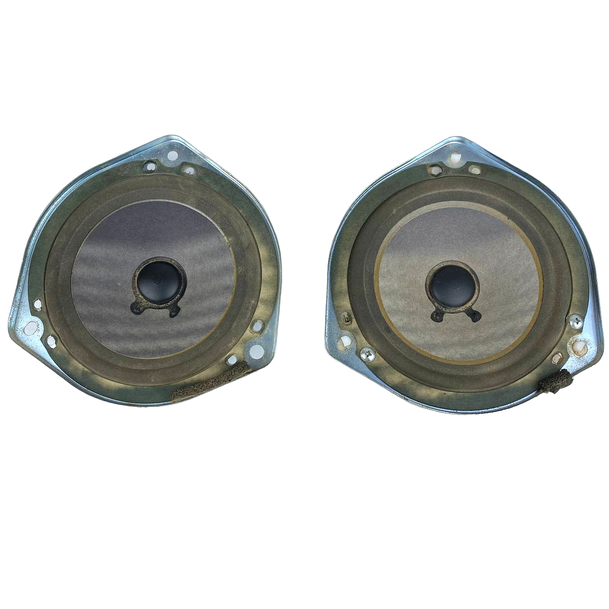

## To-do List 📃
- [x] Pick amplifier class
- [x] Pick power stage amplifier
- [x] Design and simulate in LTSPICE
- [x] Pick components with appropriate ratings
- [x] Determine thermal output of transistors
- [x] PCB design
- [ ] Testing

## History 📃
Initially, I began by driving the speaker with my USB oscilloscope/waveform generator (Analog Discovery 2). The USB waveform generator has the ability to take an MP3 file as an input and output the corresponding waveform. It also has the ability to amplify the signal up to a peak voltage of 5V. However, there were a few problems with this:
1. According to the datasheet, this waveform generator has the ability to output a maximum current of 750mA. At a peak voltage of 5V, the power output would only be (0.75A x 5V = 3.75W peak * 0.707 = 2.65W RMS) 2.65 watts RMS, which is only about 9% of the speaker's power output capabilities
2. When set to 5V peak output, the waveform generator only seemed to be able to push out 250mA. This means we were only achieving a power output of (0.25A * 5V = 1.25W peak * 0.707 = 0.883W RMS) 0.883 watts RMS.
3. Lastly, when set to 5V, the speaker seemed to suffer from a lot of distortion and resulted in very muddy tones
4. The final motivation was to see if I could drive the speaker significantly louder. With a 1V waveform signal the loudest sound seemed to be around *INSERT DB MEASUREMENT*

## Constraints ⚠️
While devising the design for this project, I established a few constraints to prevent overcomplication. The constraints/rules I settled on were as follows:
* The input/audio signal would be anywhere from 100mV to 1V
* I didn't have to make use of the full 30 watt power capabilities of the speaker

# Audio Amplifier Background
To drive a speaker louder (higher output power) there are two things to keep in mind. These elements are evident in the power equation $P = V × I$. To acheive a higher output power we must amplify both voltage and current. Achieving greater output power necessitates amplifying both voltage and current. Therefore, we divide our amplifier design into two stages: the voltage/signal amplifier stage and the current/power amplifier stage. This practice is widely employed in all types of audio amplifiers.

The subsequent step in the process involved determining the preferred classification of audio amplifiers for this design. There are four main classes: A, B, AB, and Class D. Further information about these classifications can be found in the links provided below.

  

### Class A Amplifiers
* Transistors conduct over the entire 360° cycle of the input signal
* Highest linearity and fidelity, with minimal crossover distortion
* Very inefficient, with typical efficiency around 25% due to constant current draw
* Significant heat dissipation and power wastage, even with no input signal
* Used in low-power applications where sound quality is the top priority

### Class B Amplifiers
* Use a pair of transistors, each conducting for 180° of the input signal cycle
* Improved efficiency over Class A, up to 78% theoretical maximum
* Suffer from crossover distortion around the zero-crossing point when transitioning between transistors
* Reduced heat dissipation compared to Class A
* Used in applications where efficiency is more important than linearity

### Class AB Amplifiers
*Combine the high efficiency of Class B with the low distortion of Class A
* Bias both transistors to conduct for slightly more than 180° to eliminate crossover distortion
* Efficiency up to 60%, lower than Class B but higher than Class A
* Moderate heat dissipation, less than Class A but more than Class B
* Popular choice for high-fidelity audio amplifiers, balancing efficiency and sound quality

I ended up settling on designing a Class AB amplifier due to its compromise between efficiency and fidelity.

The second decision was whether to use MOSFETs or BJTs for the power stage amplifier. I ultimately chose MOSFETs for the following reasons:
* They generally have high input impedance, which reduces the loading effect on the preceding stages
* They require no current to drive the gate pin
* They can switch faster than BJTs, which can be beneficial in certain applications
* Reduced distortion compared to some BJT designs
* The only drawback is they tend to be more expensive than BJT's

### Initial Class A Design
My initial design was based on the class A amplifier design, as shown in the image below. However, the issue arose from its excessive current draw from the op-amp. Additionally, in the absence of a signal input, the amplifier continues to conduct large amounts of current, which could potentially damage the speaker.

  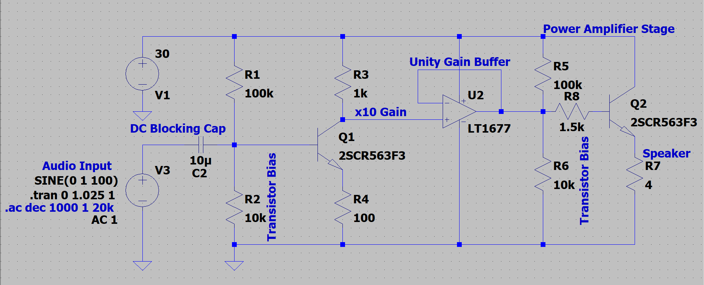
  
<small><i>Class A Amplifier Design in LTSpice</i></small

  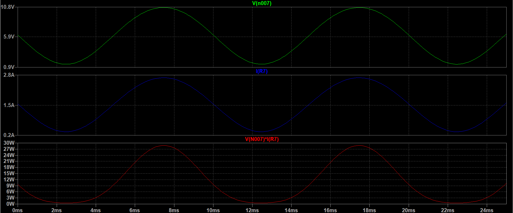
  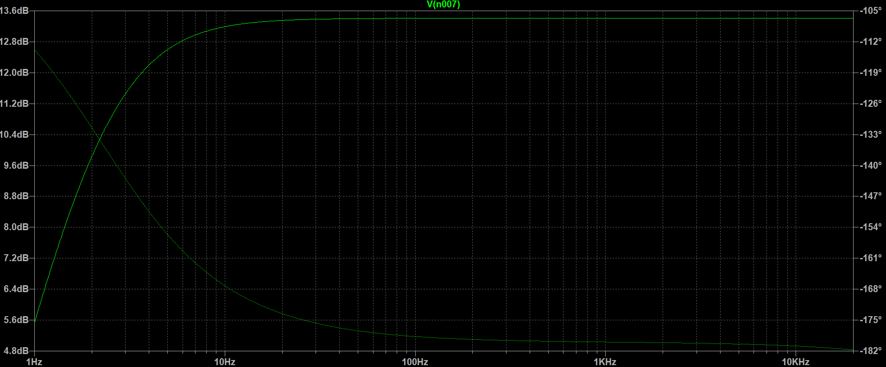

  
<small><i>Class A Amplifier Simulation in LTSpice</i></small

# Final Class AB Design
## Schematic

  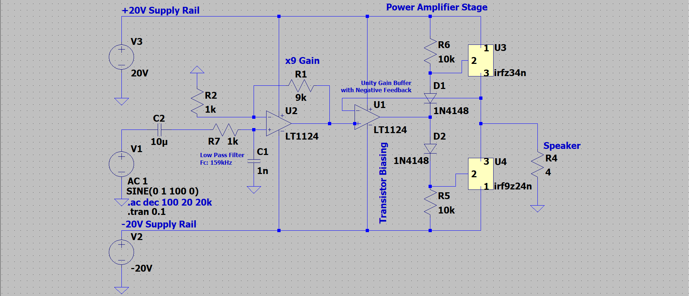
  
<small><i>Class AB Amplifier LTSpice Schematic Capture</i></small>

* For this design, I ended up choosing the LT1124 op-amp for the signal amplifying stage. There were a couple of reasons behind this decision. Initially, I had planned for that stage to use a common emitter amplifier. However, the issue was that it required fine-tuning to determine the bias voltages. Additionally, by using the LT1124 op-amp, I could incorporate a potentiometer for variable gain ranging from 0 to 10dB.
* For the power stage of this amplifier, I ended up utilizing the op-amp's inverting terminal as a negative feedback loop for the push-pull configuration. This allowed me to avoid fine-tuning the bias voltages with resistors and diodes.

## Simulation

  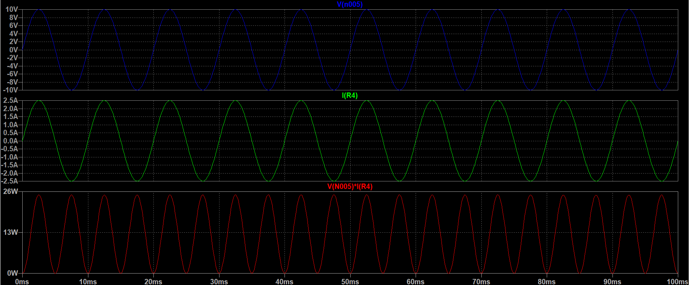
  
<small><i>[1]Output Voltage [2]Output Current [3]Output Power</i></small

  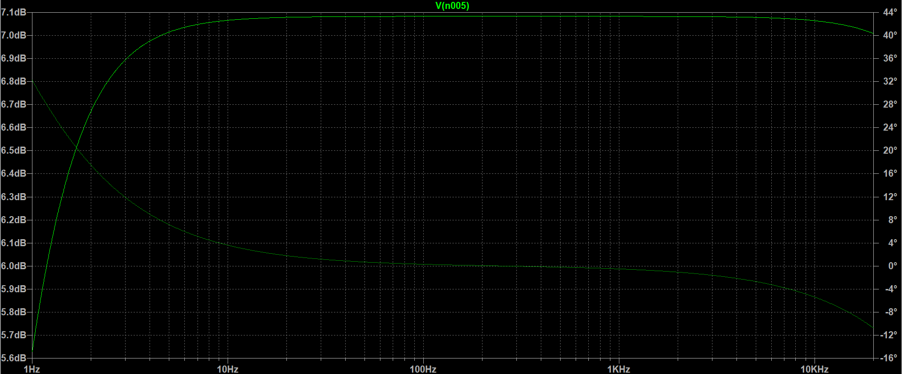
  
<small><i>Amplifier Frequency Response 1Hz - 20kHz</i></small

* For the spice simulation of the MOSFETs, custom models were obtained online through Infineon's website. The custom models can be found in the *spice_models* folder.

# Parts
## OP-AMP
I ended up settling on the [LT1124](https://www.analog.com/en/products/lt1124.html)
* Power supply range: ±22V (Dual rail supplies)
* Slew rate: 3.9 - 4.5 V/us
  * To maintain high fidelity audio it is recommended to have a slew rate of +5V/us.
  * We can determine the minimum slew rate given the expected output voltage and frequency. Our maximum output voltage should be 10V and our maximum frequency should be around 20kHz (The upper limit of human hearing). Using the slew rate formula ($Slew Rate = 2πfv$)
  * $Minimum Slew Rate = 2 * π * 20000 * 10 = 1.256V/μS$ 
* Gain-Bandwidth product: 12.5MHz
* Low voltage noise: 2.7nV/√Hz Typ

## N-MOSFET
I ended up settling on the [IRFZ34NPBF](https://www.digikey.ca/en/products/detail/infineon-technologies/IRFZ34NPBF/811724)
* Maximum VDS: 55V
* Continuous drain current: 29A
* Maximum power dissipation: 68W
  * No additional cooling is required since we will not exceed this power rating
* Gate to source voltage: ±20V
* Gate threshold voltage: 2-4V
* RDS(ON): 0.04 ohms
* Turn-on delay time: 7ns
* Rise time: 49ns
* Turn-off delay time: 31ns
* Fall time: 40ns
* Input capacitanceL 700pF

## P-MOSFET
I ended up settling on the [IRF9Z24NPBF](https://www.digikey.ca/en/products/detail/infineon-technologies/IRF9Z24NPBF/811747)
* Maximum VDS: -55V
* Continuous drain current: -12A
* Maximum power dissipation: 45W
  * No additional cooling is required since we will not exceed this power rating
* Gate to source voltage: ±20V
* Gate threshold voltage: (-2V)-(-4V)
* RDS(ON): 0.175 ohms
* Turn-on delay time: 13ns
* Rise time: 55ns
* Turn-off delay time: 23ns
* Fall time: 37ns
* Input capacitanceL 350pF

*Both MOSFET's chosen are overkill for our purposes but provide sufficient headroom for error and/or future upgrades*

## N-MOSFET Junction Temperature Calculation
$Pavg = (Irms^2 * Rds(on))/2$
 * $Irms = Ipeak/√2 = 3A / √2 = 2.12A$
 * Rds(on) = 0.040 ohms
 * $Pavg = (2.12^2A * 0.04ohms)/2 = 0.08988 W$

$Tj = Pavg * RthJA + TA$
 * $Pavg = 0.08988W$
 * $RthJA = 62W/C$
 * $TA = 25C$
 * $Tj = 0.08988W * 62W/C + 25C = 30.57C$

## P-MOSFET Junction Temperature Calculation
$Pavg = (Irms^2 * Rds(on))/2$
 * $Irms = Ipeak/√2 = 3A / √2 = 2.12A$
 * Rds(on) = 0.175 ohms
 * $Pavg = (2.12^2A * 0.175ohms)/2 = 0.3932W$
 
$Tj = Pavg * RthJA + TA$
 * $Pavg = 0.3932$
 * $RthJA = 62W/C$
 * $TA = 25C$
 * $Tj = 0.3932W * 62W/C + 25C = 49.38C$

Based on the above calculations the MOSFETs shouldn't require any additional cooling methods.

## Power Supply Consideration
This design requires a positive and negative supply of 20V. This can be done using two power supplies and setting the ground references appropriately as described in this website ([Get a positive and negative voltage output from power supply](https://forum.digikey.com/t/get-a-positive-and-negative-voltage-output-from-power-supply/10593)). Alternatively, I have created another design that uses a single 40V DC power supply. As seen in the schematic below, the voltage/signal amplifier and current/power amplifier remain the same. The key difference is that now the power rails are supplied by the LTM8027 DC/DC voltage regulator. The configuration of each regulator allows it to take an input of 40V and supply the top rail with 20V (4A) and the bottom rail with -20V(4A). According to the LTSpice simulation this circuit should function similarly to the original design. Additionally, the LTM8027 has a maximum switching speed of 500kHz so the frequency shouldn't be affected. <i>NOTE A split power supply design could be used however the appropriate regulators must be chosen so that the voltage rails under load remain stable</i>

## DC Bias Alternative
The above design is a true class AB amplifier design, which makes use of a 180-degree conduction angle and removes crossover distortion. As mentioned previously, producing a negative supply with a high enough power output for the above design is very difficult and requires specialized ICs. The boost regulators mentioned above are not as desirable in such an application because they tend to introduce more noise. An alternative design can be seen below. This design utilizes a DC bias voltage to center the audio signal on a positive DC voltage, allowing us to use a single 30V supply. The signal is then passed through a unity gain buffer and then to the push-pull amplifier configuration. The push-pull amplifier configuration is used as a power stage amplifier, allowing us to push more power through the speaker. A large high-pass filter is added at the end to remove the initial DC bias. Unfortunately, the MOSFETs used in the previous designs could not be used for this circuit because their frequency response was not satisfactory above 10kHz.

### DC Bias Schematic 

  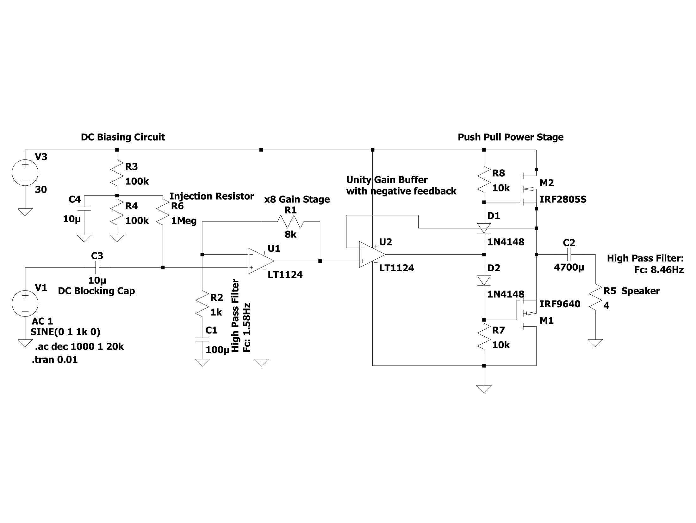
  
<small><i>LTSPICE Schematic Capture</i></small>

### DC Bias Simulation

  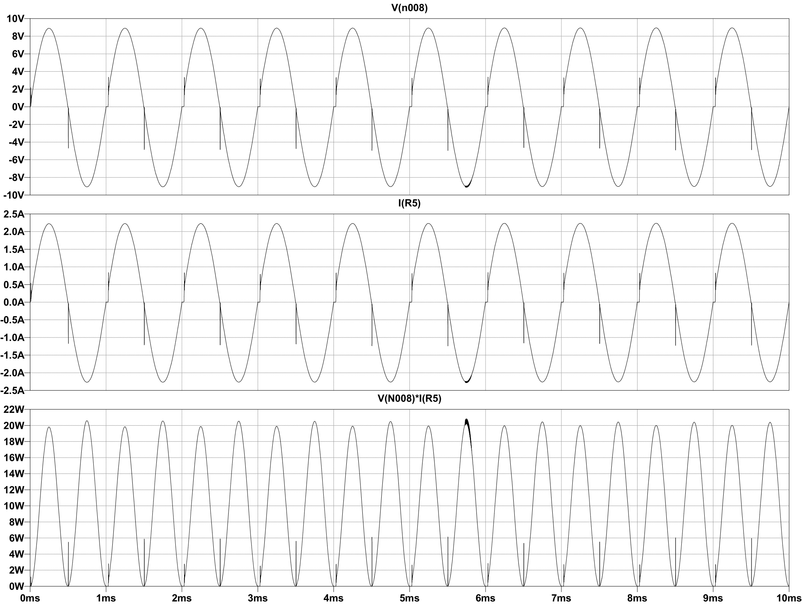
  
<small><i>[1]Output Voltage [2]Output Current [3]Output Power</i></small>

### DC Bias Frequency Response

  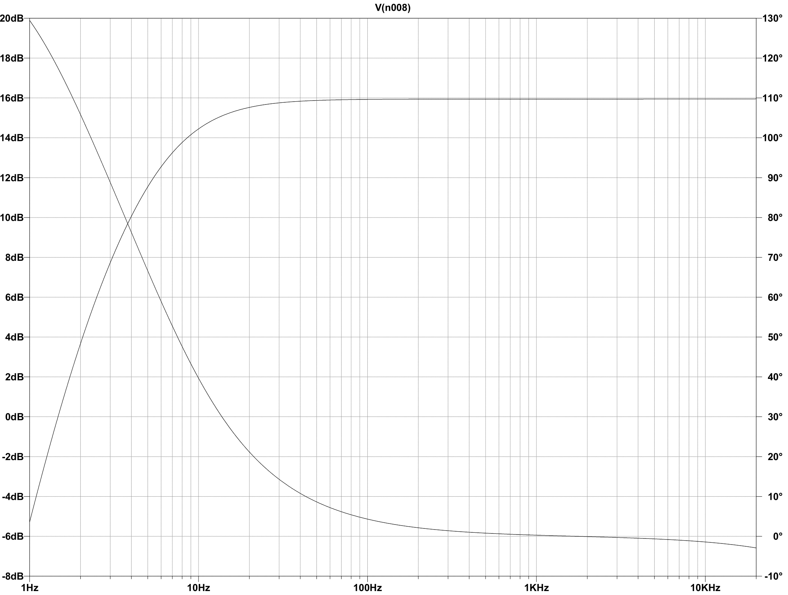
  
<small><i>DC Bias Circuit Frequency Response (1Hz - 20kHz)</i></small>

# PCB

## 3D View 

  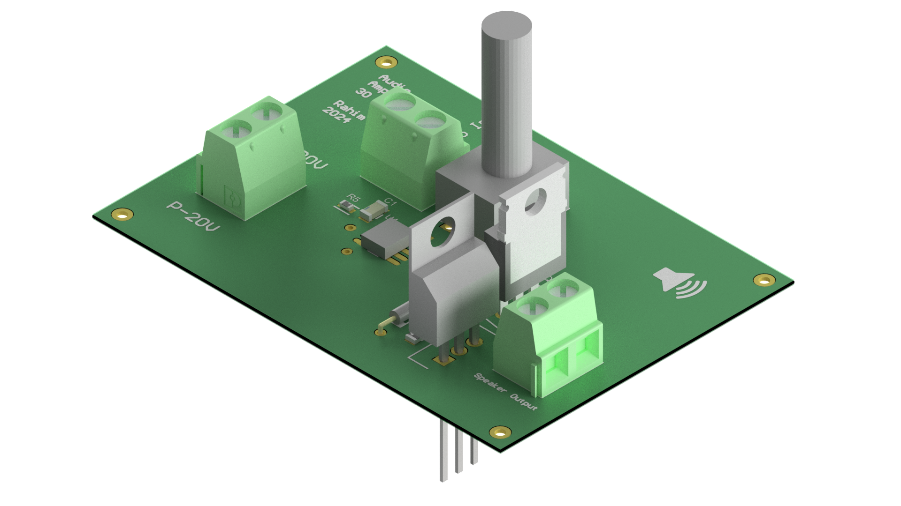
  
<small><i>3D Audio Amplifier Render</i></small>

* One of the key considerations during this design was the use of power and ground planes. In this design, I settled on a 2 layer board design because it was cheap and simple to design. The layers are relatively thick to allow for large amounts of current to pass through the traces. However, the board might have benefited from a +20V, -20V, and GND planes. This would help dissipate heat better and reduce electromagnetic interference. 

## Power Integrity

  
  
<small><i>Power Analyzer by Keysight - Altium</i></small>

* I used the Saturn PCB Design Toolkit to determine the amount of current that the VIAs could handle. Based on power integrity simulations, the VIAs were more than capable of meeting the current requirements. Nevertheless, I ended up adding extra headroom for the current by increasing both the trace width and PCB thickness.

# Resources
* LTSPICE
* [Amplifier Series](https://www.youtube.com/watch?v=Yv75o45Zrak&list=PL1GmhyN81MlmMcJZy58bTeupRl7zOO8Sk&index=2&ab_channel=EEforEveryone)
* [Online Circuit Simulator](https://www.falstad.com/circuit/)
* [Introduction to the Amplifier](https://www.electronics-tutorials.ws/amplifier/amp_1.html)
* [Audio Amplifier Basics](https://www.youtube.com/watch?v=U0FIG2J6Zls&ab_channel=TexasInstruments)
* [Power Amplifiers](https://en.wikipedia.org/wiki/Power_amplifier_classes#Class_C)
